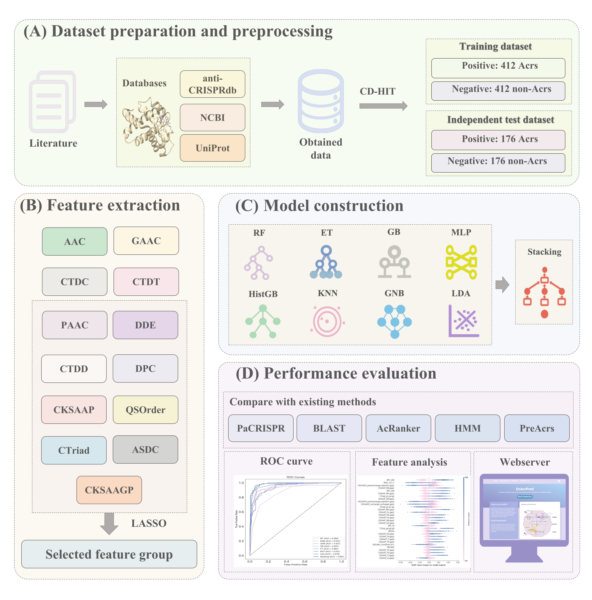

# EnAcrPred
The identification of anti-CRISPR proteins (Acrs) is crucial for understanding the regulation of CRISPR-Cas systems and their application in gene editing.  However, current experimental methods face challenges, particularly in detecting Acrs with low similarity to known protein sequences. To address these challenges, we propose EnAcrPred, an advanced prediction framework based on ensemble learning. The model combines features such as sequence composition, order correlation, and inferred structure, and utilizes a stacking ensemble architecture to integrate multiple base models, which enhances both the accuracy and generalization ability of the predictions.Experimental results demonstrate that EnAcrPred achieves superior performance over existing methods across multiple evaluation metrics, further confirming its robustness. Additionally, SHapley Additive exPlanations (SHAP) value analysis identifies the key features influencing Acrs recognition. Overall, EnAcrPred offers an effective solution for Acrs identification, contributing to the advancement of gene editing research and safety.


 
# EnAcrPred - Anti-CRISPR Protein Prediction Tool

## Quick Start

### Using the Pre-trained Model

We provide the trained EnAcrPred stacking model file: `EnAcrPred_model.pkl`

```python
import joblib
import numpy as np

# Load the model
model = joblib.load('EnAcrPred_model.pickle')

# Prepare features (you need to extract 359-dimensional features first)
# features = your_feature_extraction(protein_sequence)

# Make prediction
prediction = model.predict([features])[0]
probability = model.predict_proba([features])[0]

print(f"Predict outcome: {'Acr' if prediction == 1 else 'Non-Acr'}")
print(f"Acr probability: {probability[1]:.4f}")
```

**Note**: Please ensure that the correct 359-dimensional features have been extracted before use. For the feature extraction method, please refer to our code.
